# Implemented Chapter 4 rule examples

Generated PNGs visibly mark the checker elements responsible for one finding from
each implemented rule. Red denotes requirement errors; orange denotes warnings.

## Rule 4.2.1: `node_overlap`

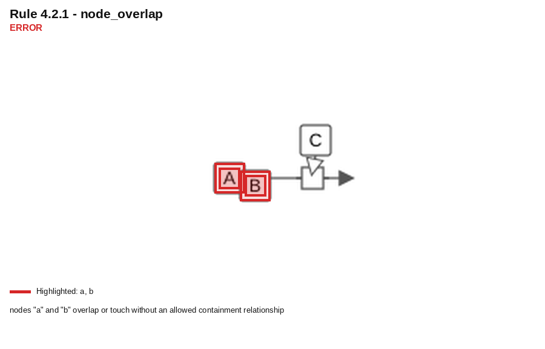

- Severity: **error**
- Source: `testdata/chapter4/4_2_1_node_overlap_1.sbgn`
- Finding: nodes "a" and "b" overlap or touch without an allowed containment relationship

## Rule 4.2.3: `node_border_edge_overlap`

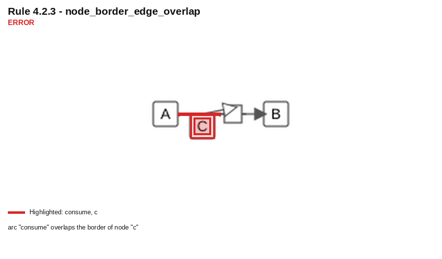

- Severity: **error**
- Source: `testdata/chapter4/4_2_3_node_border_edge_overlap_1.sbgn`
- Finding: arc "consume" overlaps the border of node "c"

## Rule 4.2.4: `edge_edge_overlap_or_touch`

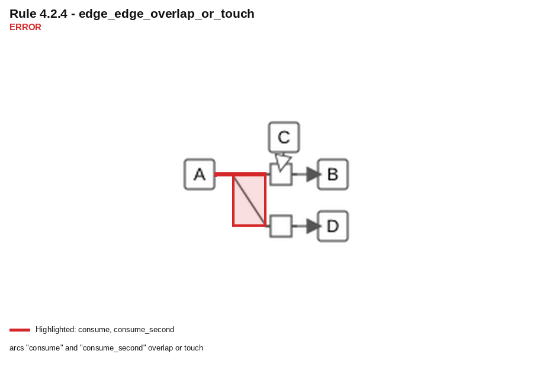

- Severity: **error**
- Source: `testdata/chapter4/4_2_4_edge_overlap_1.sbgn`
- Finding: arcs "consume" and "consume_second" overlap or touch

## Rule 4.2.5: `invalid_node_orientation`

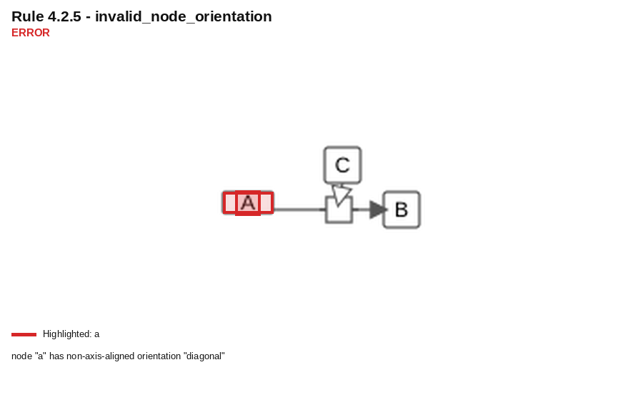

- Severity: **error**
- Source: `testdata/chapter4/4_2_5_diagonal_orientation_1.sbgn`
- Finding: node "a" has non-axis-aligned orientation "diagonal"

## Rule 4.2.6: `process_flow_not_centered`

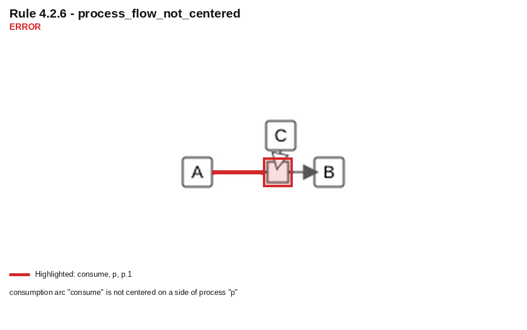

- Severity: **error**
- Source: `testdata/chapter4/4_2_6_process_attachment_1.sbgn`
- Finding: consumption arc "consume" is not centered on a side of process "p"

## Rule 4.2.7: `node_label_outside_node`

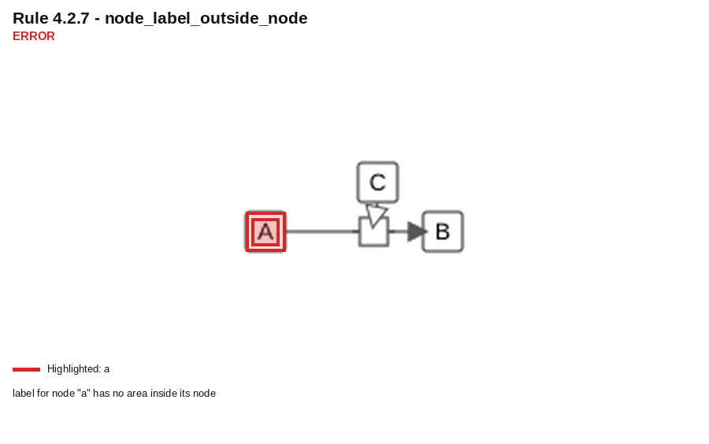

- Severity: **error**
- Source: `testdata/chapter4/4_2_7_node_labels_1.sbgn`
- Finding: label for node "a" has no area inside its node

## Rule 4.2.8: `edge_label_overlaps_node`

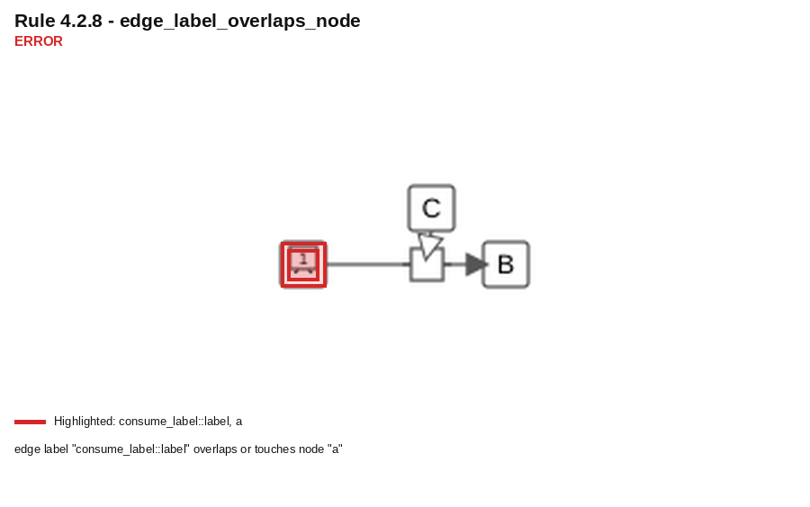

- Severity: **error**
- Source: `testdata/chapter4/4_2_8_edge_labels_1.sbgn`
- Finding: edge label "consume_label::label" overlaps or touches node "a"

## Rule 4.2.9: `process_arc_outside_compartment`

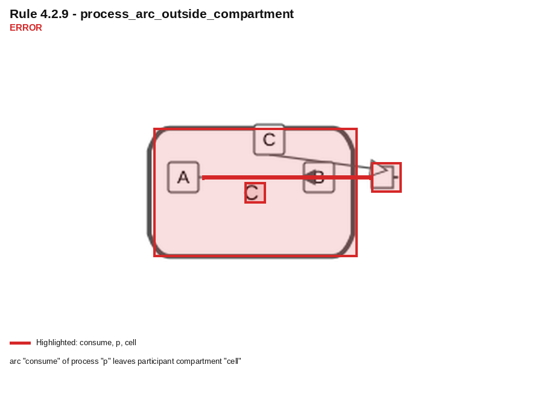

- Severity: **error**
- Source: `testdata/chapter4/4_2_9_compartments_1.sbgn`
- Finding: arc "consume" of process "p" leaves participant compartment "cell"

## Rule 4.3.1: `node_edge_crossing`

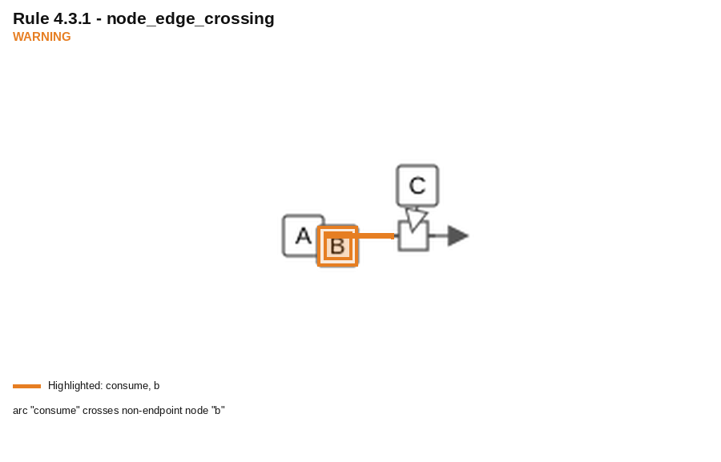

- Severity: **warning**
- Source: `testdata/chapter4/4_2_1_node_overlap_1.sbgn`
- Finding: arc "consume" crosses non-endpoint node "b"

## Rule 4.3.2: `node_label_not_fully_inside`

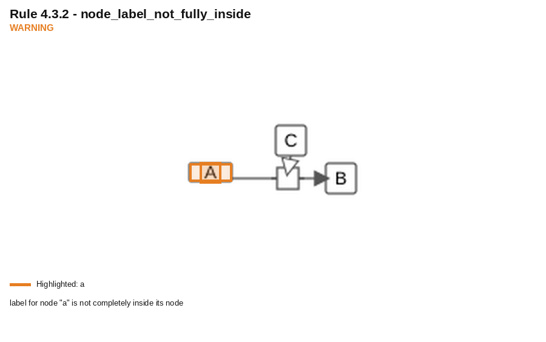

- Severity: **warning**
- Source: `testdata/chapter4/4_2_5_diagonal_orientation_1.sbgn`
- Finding: label for node "a" is not completely inside its node

## Rule 4.3.3: `edge_crossing`

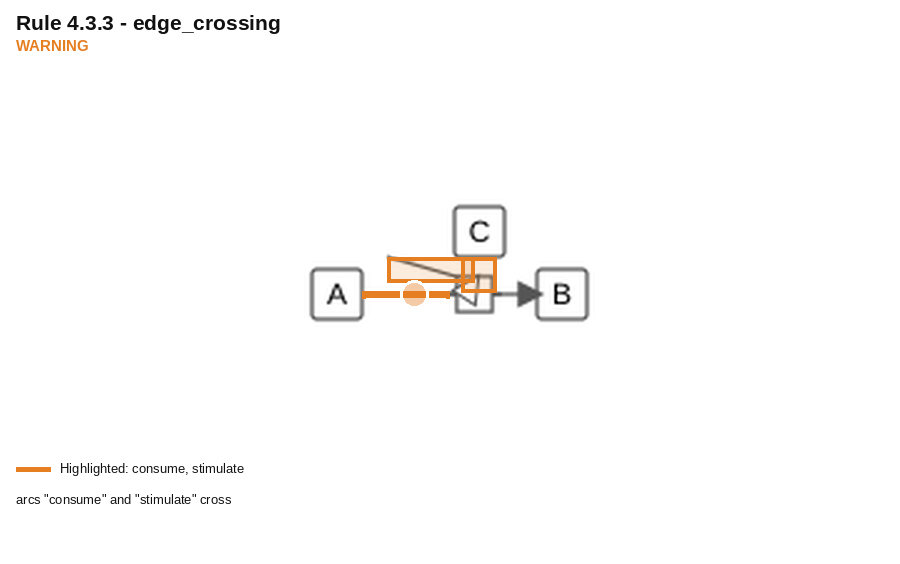

- Severity: **warning**
- Source: `testdata/chapter4/4_3_3_edge_crossings_1.sbgn`
- Finding: arcs "consume" and "stimulate" cross

## Rule 4.3.5: `unit_of_information_overlap`

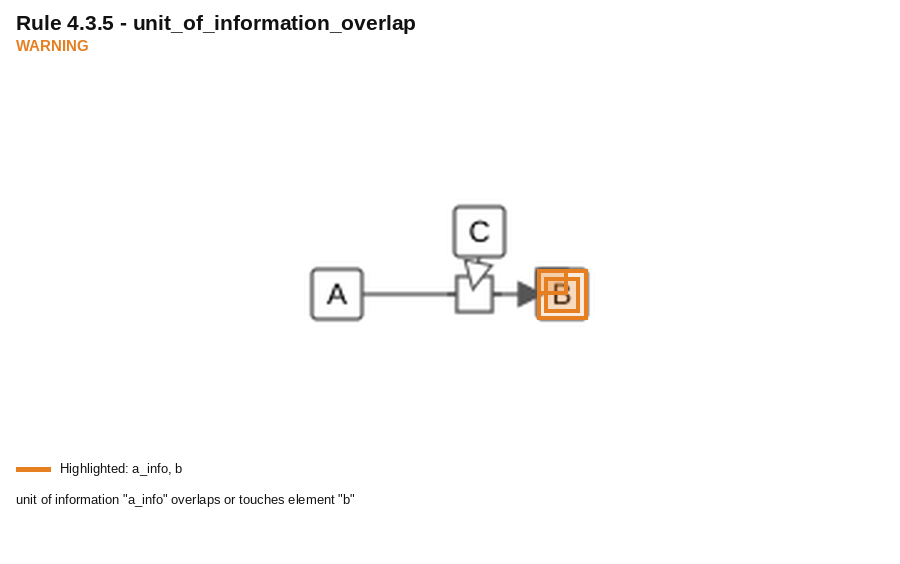

- Severity: **warning**
- Source: `testdata/chapter4/4_3_5_unit_information_1.sbgn`
- Finding: unit of information "a_info" overlaps or touches element "b"
