# Implemented rule examples

Each image below is generated from a semantically valid SBGN-PD fixture by
`scripts/render_rule_examples.py`. The red annotation names the Chapter 4 rule
and highlights the elements or exact point reported by the Go checker.

| Rule | Demonstrated finding | Annotated PNG |
|---|---|---|
| 4.2.1 | Nodes overlap or touch without allowed containment. | 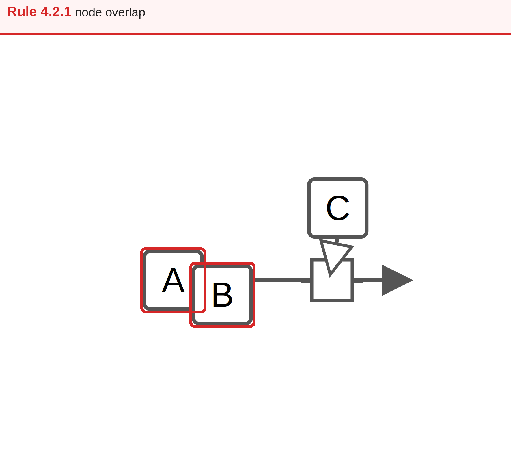 |
| 4.2.3 | An edge overlaps a node border. | 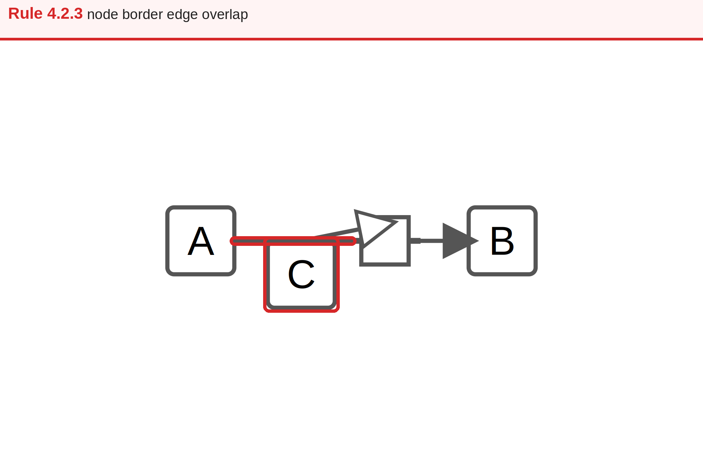 |
| 4.2.4 | Two edges overlap or touch. | 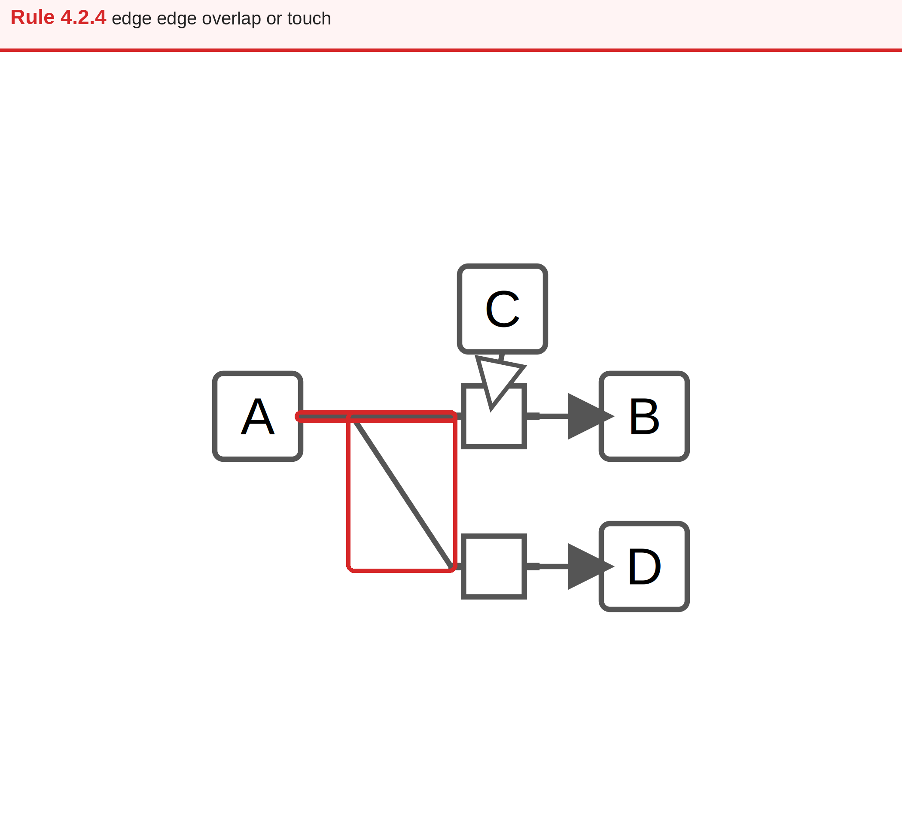 |
| 4.2.5 | A node declares a non-axis-aligned orientation. | 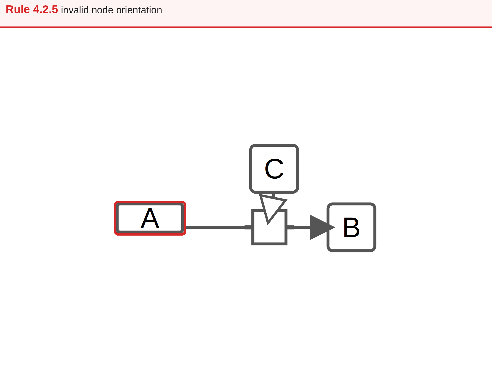 |
| 4.2.6 | A process flow arc is not centered on a process side. | 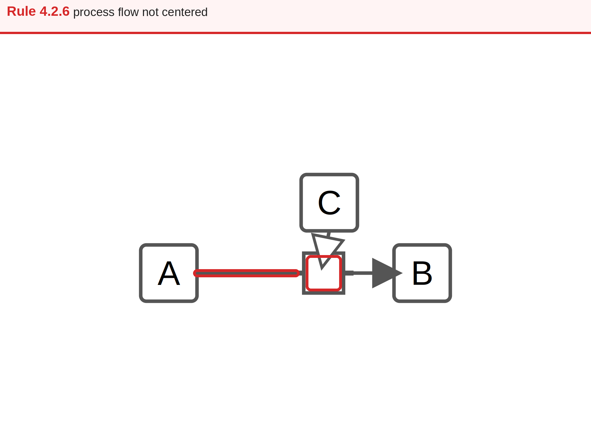 |
| 4.2.7 | A node label lies outside its node. | 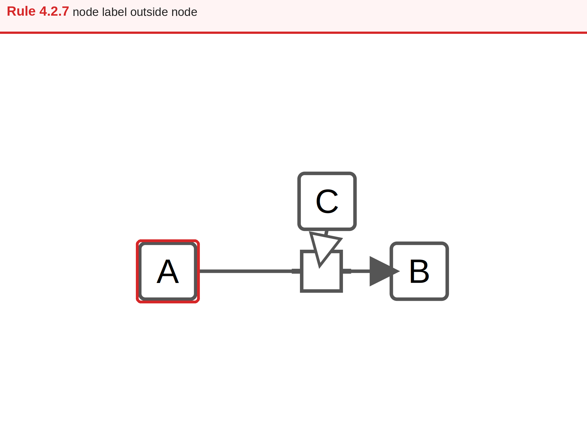 |
| 4.2.8 | An edge label overlaps a node. | 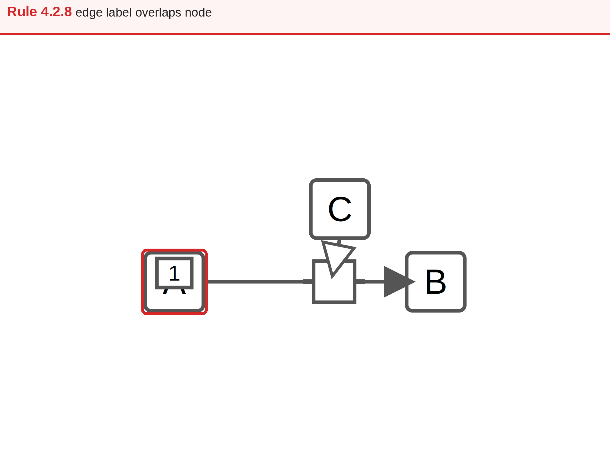 |
| 4.2.9 | A process lies outside its participants' compartment. | 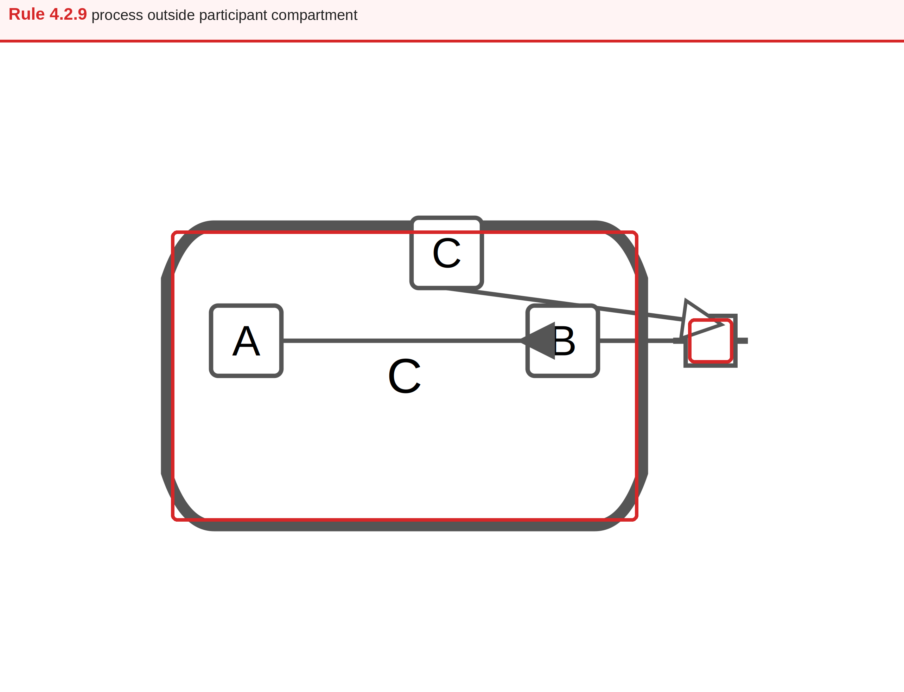 |
| 4.3.1 | An edge crosses a non-endpoint node. | 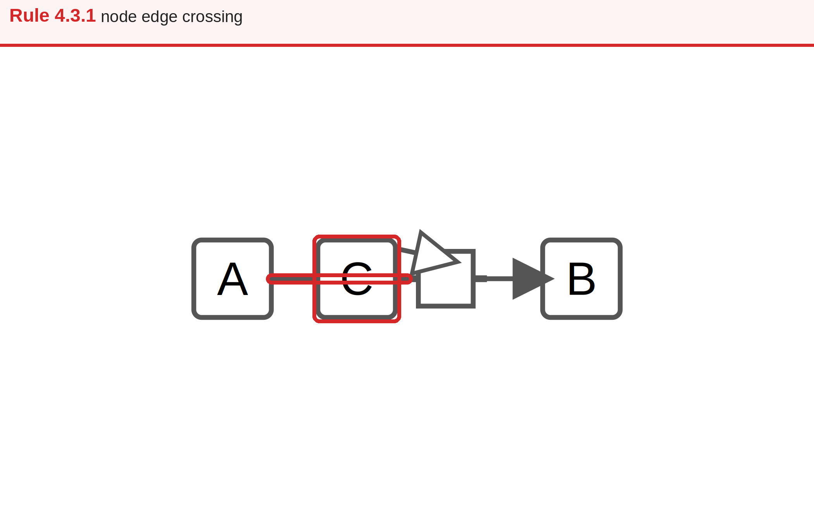 |
| 4.3.2 | A label is not fully contained by its node. |  |
| 4.3.3 | Two edges cross. | 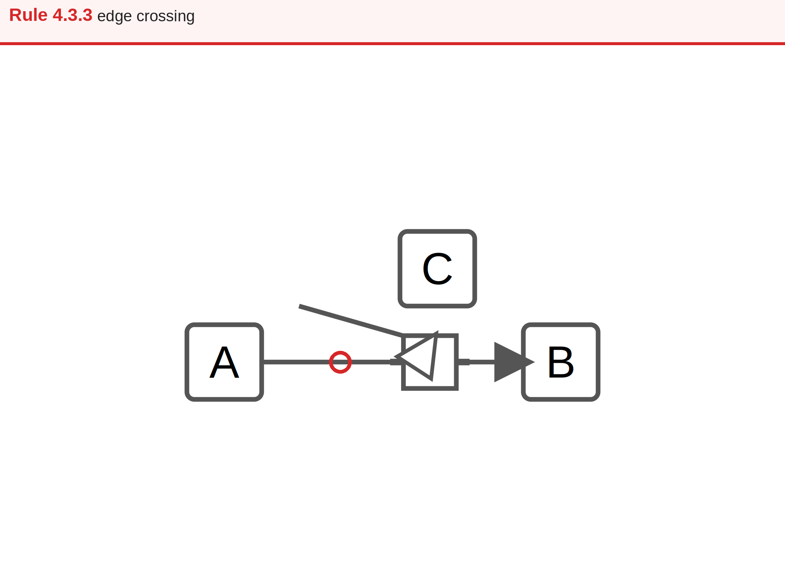 |
| 4.3.5 | A unit-of-information glyph overlaps another element. | 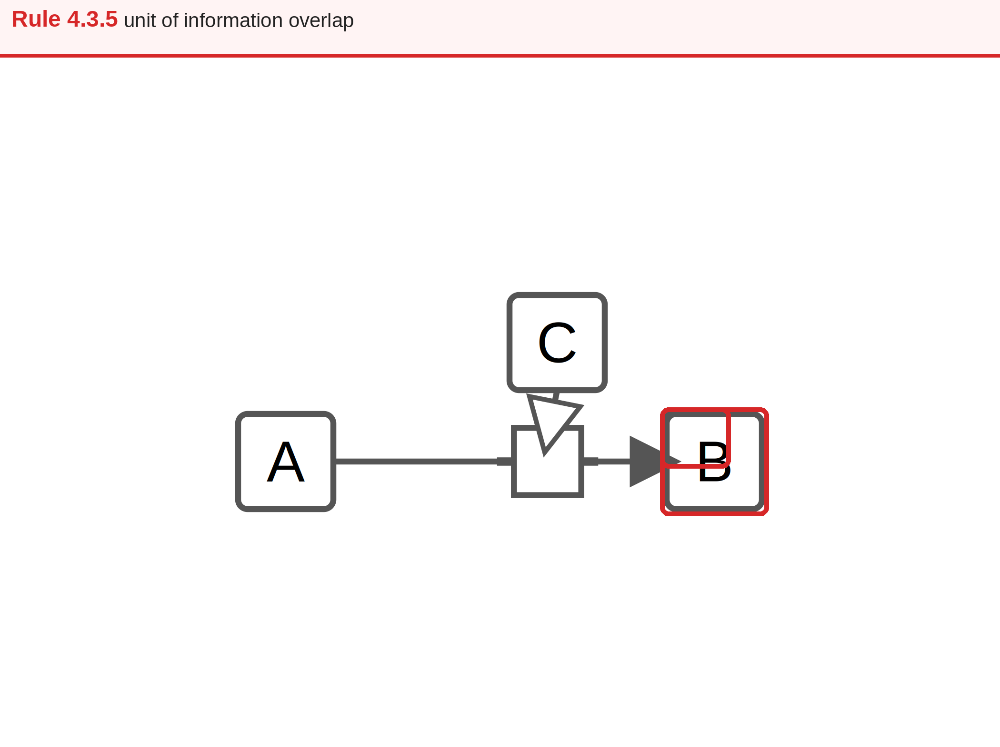 |

The remaining documented guidelines are metric-only or require visual
information that cannot be derived portably from SBGN-ML, so they do not claim
checker findings and are intentionally excluded from this gallery.