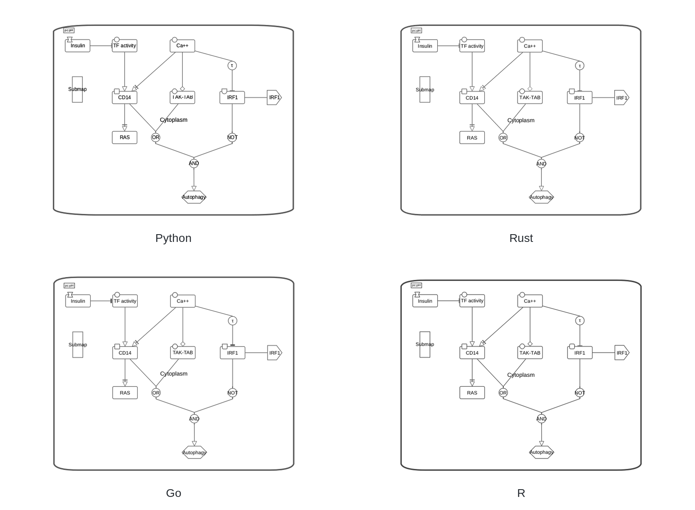
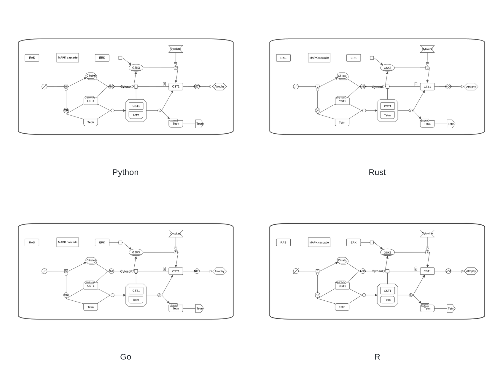

# render_sbgn

Render SBGN-ML pathway diagrams to PNG or SVG with equivalent native
implementations in Python, Rust, Go, and R. The four implementations live in
one repository so renderer behavior, examples, releases, and conformance checks
can evolve together while each package remains independently installable.

## Renderer comparison

Each two-column image compares the Python, Rust, Go, and R implementations on
the same canonical input.

### Activity flow symbols



### Process description symbols



Prebuilt packages and executables are available on the
[GitHub Releases page](https://github.com/cannin/render_sbgn/releases). Each
release includes SHA-256 checksums, complete tagged source, and separate source
archives for every implementation.

## Choose an implementation

| Implementation | Requirements | Install/build | Documentation |
| --- | --- | --- | --- |
| [Python](python/) | Python 3.10+, uv, Cairo | `cd python && uv sync` | [Python README](python/README.md) |
| [Rust](rust/) | Rust and the musl target | `./scripts/build-rust-musl.sh` | [Rust README](rust/README.md) |
| [Go](go/) | Go 1.25+ | `cd go && go build ./...` | [Go README](go/README.md) |
| [R](r/) | R 4.2+ | `R CMD INSTALL r` | [R README](r/README.md) |

Installing one implementation does not install or require the other language
toolchains.

## Release downloads

Each release provides:

- Python: a platform-independent wheel; Cairo must still be installed.
- Rust: a static musl executable for Ubuntu Linux amd64, a macOS arm64
  executable, and a Windows amd64 executable.
- Go: executables for Ubuntu Linux amd64, macOS arm64, and Windows amd64.
- R: the installable source package produced by `R CMD build` and accepted by
  `R CMD check`.
- Source: one complete monorepo archive and one tagged archive per language,
  in addition to GitHub's automatic source archives.

After downloading an executable on Linux or macOS, make it executable with
`chmod +x <download>`. Verify downloads with `SHA256SUMS.txt`.

## Quick start

All CLIs accept the same core input and output flags. These examples render the
same shared input:

```bash
# Python
(cd python && uv run render_sbgn_py draw_sbgnml \
  --input-path ../render_examples/sbgn_examples/colors.sbgn \
  --output-path colors-python.png)

# Rust (host development build)
(cd rust && cargo run -- draw_sbgnml \
  --input-path ../render_examples/sbgn_examples/colors.sbgn \
  --output-path ../colors-rust.png)

# Go
(cd go && go run . draw_sbgnml \
  --input-path ../render_examples/sbgn_examples/colors.sbgn \
  --output-path ../colors-go.png)

# R
Rscript r/draw_sbgnml.R \
  --input-path render_examples/sbgn_examples/colors.sbgn \
  --output-path colors-r.png
```

## Shared renderer behavior

The four CLIs accept SBGN-ML input and support PNG, SVG, fixed canvas sizes,
padding, clone markers, glyph colors, style JSON, and deterministic render-test
manifests. Their shared CLI includes `-i`/`--input-path`,
`-o`/`--output-path`, `-p`/`--padding`, `-f`/`--format`, clone-marker and text
contrast controls, color/style inputs, and manifest generation. Every CLI
supports equivalent `-h` and `--help` output for its native invocation.

Invalid XML, missing inputs, unsupported output extensions, invalid options,
and conflicting color/style sources return a nonzero status. PNG bytes are not
required to match across backends because font rasterization, antialiasing,
metadata, and compression can differ. Cross-language tests instead verify the
image contract and compare backend-independent manifest primitives.

## Shared examples and tests

[render_examples/](render_examples/) is the single canonical collection of
SBGN-ML test inputs. No language package contains a duplicate copy. Generated
test files are written beneath the ignored `tests/output/` directory.

Run native package checks and then render every shared input with all four
implementations:

```bash
./scripts/test-all.sh
```

Run only the shared renderer conformance suite:

```bash
./scripts/test-conformance.sh
```

The conformance suite verifies successful rendering, PNG signatures and
dimensions, and renderer manifests for every canonical `.sbgn` file.

## Continuous integration

The GitHub Actions workflow runs all four renderers on Ubuntu, including the
shared conformance suite and a statically linked Rust musl release build. Test
the same workflow locally with [act](https://github.com/nektos/act):

```bash
act push -j ubuntu-all-renderers
```

Pushing a `v*` tag runs the release workflow. The Go module also receives its
required subdirectory-prefixed tag, such as `go/vX.Y.Z`.

## Repository layout

- [python/](python/) - Python package and tests.
- [rust/](rust/) - Rust crate, musl configuration, CLI, and Lambda runtime.
- [go/](go/) - Go module, CLI, and Lambda wrappers.
- [r/](r/) - R package and source-checkout CLI.
- [render_examples/](render_examples/) - shared SBGN-ML inputs.
- [tests/](tests/) - cross-language conformance tooling and generated output.
- [AGENTS.md](AGENTS.md) - maintenance rules and exact verification commands.

## Versioning

Package metadata is coordinated across all implementations. Repository releases
use `vX.Y.Z`; because the Go module is in a subdirectory, its corresponding
module tag is `go/vX.Y.Z`.

## License

This project is available under the [MIT License](LICENSE).
